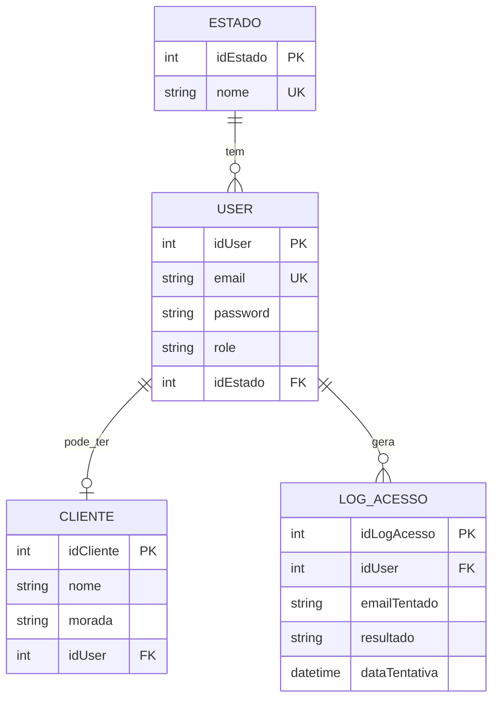
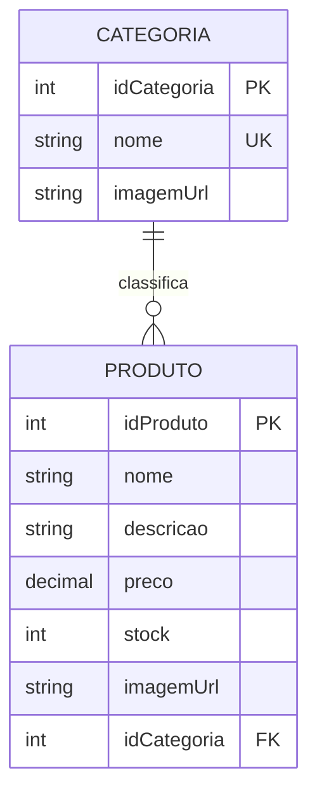
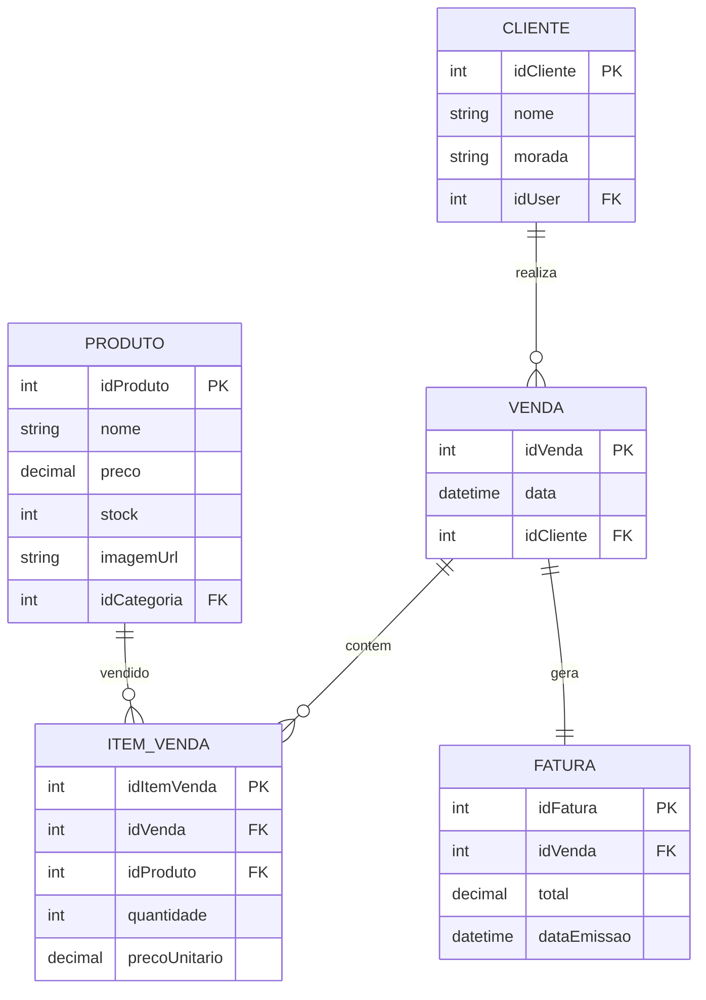

# BoostMode - Sports Store

Plataforma de e-commerce moderna e responsiva dedicada à venda de equipamentos e artigos desportivos.

O projeto oferece uma experiência completa de loja online: navegação no catálogo, pesquisa e filtros, favoritos, carrinho persistente, checkout, faturação, gestão de stock e painel administrativo com relatórios.

---

## Funcionalidades

### Cliente

* Catálogo de produtos com visualização dinâmica.
* Pesquisa por nome ou descrição.
* Filtros por categoria, preço mínimo, preço máximo e stock.
* Visualização individual de produto.
* Imagens por produto.
* Imagens por categoria.
* Fallback automático para imagem default.
* Seleção de quantidade antes de adicionar ao carrinho.
* Carrinho de compras persistente na base de dados.
* Favoritos por cliente.
* Checkout com criação de venda, itens de venda e fatura.
* Consulta de faturas.
* Área de cliente.

### Autenticação

* Registo e login de utilizadores.
* Sistema de autenticação com Spring Security.
* Passwords encriptadas com BCrypt.
* Gestão de permissões por role: `ADMIN` e `CLIENTE`.
* Registo de tentativas de login.
* Bloqueio de utilizadores após várias tentativas falhadas.
* Controlo de estados de conta: `ATIVO`, `INATIVO`, `BLOQUEADO`, `PENDENTE`.

### Administração

* Painel administrativo.
* Gestão de utilizadores.
* Promoção de utilizadores para administrador.
* Gestão de produtos.
* Gestão de categorias.
* Relatórios administrativos.
* KPIs de faturação, vendas, produtos vendidos e clientes ativos.
* Tabelas de vendas recentes.
* Gráficos de faturação diária.
* Produtos mais vendidos.
* Categorias mais vendidas.
* Endpoint JSON para atualização de dados dos relatórios.

### Base de Dados

* Views para consultas frequentes.
* Stored procedures para operações e relatórios.
* Triggers para validação de regras de negócio.
* Indexes para otimização.
* Controlo de stock no checkout.
* Validação de clientes ativos antes de vendas.

---

## Tecnologias Utilizadas

* **Frontend:** HTML5, CSS3, Thymeleaf, JavaScript
* **Gráficos:** Chart.js
* **Backend:** Java, Spring Boot, Spring MVC, Spring Security
* **Persistência:** Spring Data JPA / Hibernate
* **Base de Dados:** MySQL
* **Build Tool:** Maven
* **Containerização:** Docker / Docker Compose
* **Acesso remoto opcional:** Tailscale Serve

---

## Instalação e Configuração

### 1. Clonar o repositório

```bash
git clone https://github.com/KJBruninho/Sports_Store.git
```

### 2. Aceder à pasta do projeto

```bash
cd Sports_Store/BoostMode-Sport-Store/
```

### 3. Executar com Docker Compose

```bash
docker compose up --build
```

### 4. Reiniciar a base de dados do zero

Sempre que alterares o `init.sql`, remove o volume antigo antes de subir novamente:

```bash
docker compose down -v
docker compose up --build
```

---

## Configuração da Base de Dados

A aplicação usa MySQL.

Exemplo de configuração esperada:

```properties
spring.datasource.url=jdbc:mysql://mysql:3306/sports_store?useSSL=false&allowPublicKeyRetrieval=true&serverTimezone=Europe/Lisbon
spring.datasource.username=root
spring.datasource.password=password

spring.jpa.hibernate.ddl-auto=none
spring.jpa.show-sql=true
spring.jpa.properties.hibernate.format_sql=true
spring.sql.init.mode=never
```

A estrutura da base de dados é criada pelo script SQL inicial.

---

## Utilizadores de Teste

A password usada nos dados de exemplo é:

```text
123456
```

| Email                 | Password | Role    |
| --------------------- | -------- | ------- |
| admin@example.com     | 123456   | ADMIN   |
| user1@example.com     | 123456   | CLIENTE |
| user2@example.com     | 123456   | CLIENTE |
| carlos@example.com    | 123456   | CLIENTE |
| bloqueado@example.com | 123456   | CLIENTE |

---

## Estrutura do Projeto

```text
src/
├── main/
│   ├── java/
│   │   └── com/example/demo/
│   │       ├── controllers/
│   │       │   ├── AdminController.java
│   │       │   ├── AdminRelatoriosController.java
│   │       │   ├── CarrinhoController.java
│   │       │   ├── CatalogoController.java
│   │       │   ├── CheckoutController.java
│   │       │   ├── ClienteController.java
│   │       │   ├── CustomErrorController.java
│   │       │   ├── FavoritoController.java
│   │       │   ├── FaturaController.java
│   │       │   ├── MainController.java
│   │       │   └── ProdutoController.java
│   │       │
│   │       ├── models/
│   │       ├── repositories/
│   │       ├── CustomUserDetailsService.java
│   │       ├── SecurityConfig.java
│   │       └── ProjetoSdApplication.java
│   │
│   └── resources/
│       ├── db/
│       │   └── init.sql
│       ├── static/
│       │   ├── css/
│       │   └── img/
│       ├── templates/
│       └── application.properties
│
├── Dockerfile
├── docker-compose.yml
├── mvnw
├── mvnw.cmd
└── pom.xml
```

---

# Estrutura da Base de Dados - BoostMode

A base de dados está organizada em cinco áreas principais:

* Autenticação e clientes
* Catálogo de produtos
* Carrinho e favoritos
* Vendas e faturação
* Logs de acesso

---

## Regras de Negócio Principais

### User e Cliente

* `user` representa a conta de autenticação.
* `cliente` representa o perfil comercial.
* Um `user` pode existir sem `cliente`.
* Um `cliente` não pode existir sem `user`.
* Um `user` com role `ADMIN` normalmente não tem registo em `cliente`.
* Um `user` com role `CLIENTE` deve ter um registo correspondente em `cliente`.
* `cliente.idUser` é `NOT NULL` e `UNIQUE`.

### Carrinho

* Cada linha da tabela `carrinho` representa um produto no carrinho de um cliente.
* O par `(idCliente, idProduto)` é único.
* Se o cliente adicionar o mesmo produto novamente, a quantidade deve ser atualizada.
* A quantidade no carrinho deve ser maior que zero.
* A quantidade no carrinho não pode ultrapassar o stock disponível.

### Vendas

* Uma venda pertence sempre a um cliente.
* Só clientes com conta ativa podem comprar.
* Uma venda contém um ou mais itens em `item_venda`.
* Cada venda gera uma única fatura.
* `fatura.idVenda` é `UNIQUE`.
* O stock é atualizado após a finalização da compra.

### Imagens

* Um produto pode ter imagem própria através de `produto.imagemUrl`.
* Se o produto não tiver imagem, é usada a imagem da categoria através de `categoria.imagemUrl`.
* Se nenhuma imagem estiver disponível, é usada a imagem default.
* `imagemUrl` pode ser um caminho local, por exemplo `/img/categorias/futebol.png`, ou um URL externo.

---

# Tabelas

## estado

| Campo    | Tipo        | Chave  | Observação     |
| -------- | ----------- | ------ | -------------- |
| idEstado | INT         | PK     | Auto increment |
| nome     | VARCHAR(50) | UNIQUE | Nome do estado |

Estados principais:

* `ATIVO`
* `INATIVO`
* `BLOQUEADO`
* `PENDENTE`

---

## user

| Campo    | Tipo         | Chave  | Observação                     |
| -------- | ------------ | ------ | ------------------------------ |
| idUser   | INT          | PK     | Auto increment                 |
| email    | VARCHAR(255) | UNIQUE | Email usado no login           |
| password | VARCHAR(255) |        | Password encriptada com BCrypt |
| role     | VARCHAR(50)  |        | `ADMIN` ou `CLIENTE`           |
| idEstado | INT          | FK     | Referência a `estado`          |

---

## cliente

| Campo     | Tipo         | Chave      | Observação                                  |
| --------- | ------------ | ---------- | ------------------------------------------- |
| idCliente | INT          | PK         | Auto increment                              |
| nome      | VARCHAR(255) |            | Nome do cliente                             |
| morada    | VARCHAR(255) |            | Morada do cliente                           |
| idUser    | INT          | FK, UNIQUE | Cliente depende obrigatoriamente de um user |

---

## log_acesso

| Campo         | Tipo         | Chave    | Observação                        |
| ------------- | ------------ | -------- | --------------------------------- |
| idLogAcesso   | INT          | PK       | Auto increment                    |
| idUser        | INT          | FK, NULL | User associado, se existir        |
| emailTentado  | VARCHAR(255) |          | Email usado na tentativa de login |
| resultado     | ENUM         |          | Resultado da tentativa            |
| dataTentativa | DATETIME     |          | Data e hora da tentativa          |

Resultados possíveis:

* `SUCESSO`
* `PASSWORD_INCORRETA`
* `EMAIL_INEXISTENTE`
* `CONTA_BLOQUEADA`

---

## categoria

| Campo       | Tipo         | Chave  | Observação                     |
| ----------- | ------------ | ------ | ------------------------------ |
| idCategoria | INT          | PK     | Auto increment                 |
| nome        | VARCHAR(255) | UNIQUE | Nome da categoria              |
| imagemUrl   | VARCHAR(500) |        | Caminho local ou URL da imagem |

---

## produto

| Campo       | Tipo          | Chave | Observação                     |
| ----------- | ------------- | ----- | ------------------------------ |
| idProduto   | INT           | PK    | Auto increment                 |
| nome        | VARCHAR(255)  |       | Nome do produto                |
| descricao   | TEXT          |       | Descrição do produto           |
| preco       | DECIMAL(10,2) |       | Preço                          |
| stock       | INT           |       | Quantidade disponível          |
| imagemUrl   | VARCHAR(500)  |       | Caminho local ou URL da imagem |
| idCategoria | INT           | FK    | Categoria do produto           |

---

## carrinho

| Campo          | Tipo     | Chave | Observação               |
| -------------- | -------- | ----- | ------------------------ |
| idItemCarrinho | INT      | PK    | Auto increment           |
| idCliente      | INT      | FK    | Cliente dono do carrinho |
| idProduto      | INT      | FK    | Produto no carrinho      |
| quantidade     | INT      |       | Quantidade do produto    |
| dataAdicao     | DATETIME |       | Data de adição           |

Restrição:

```sql
UNIQUE (idCliente, idProduto)
```

---

## favorito

| Campo       | Tipo     | Chave | Observação       |
| ----------- | -------- | ----- | ---------------- |
| idFavorito  | INT      | PK    | Auto increment   |
| idCliente   | INT      | FK    | Cliente          |
| idProduto   | INT      | FK    | Produto favorito |
| dataCriacao | DATETIME |       | Data de criação  |

Restrição:

```sql
UNIQUE (idCliente, idProduto)
```

---

## venda

| Campo     | Tipo     | Chave | Observação                   |
| --------- | -------- | ----- | ---------------------------- |
| idVenda   | INT      | PK    | Auto increment               |
| data      | DATETIME |       | Data da venda                |
| idCliente | INT      | FK    | Cliente que realizou a venda |

---

## item_venda

| Campo         | Tipo          | Chave | Observação                |
| ------------- | ------------- | ----- | ------------------------- |
| idItemVenda   | INT           | PK    | Auto increment            |
| idVenda       | INT           | FK    | Venda associada           |
| idProduto     | INT           | FK    | Produto vendido           |
| quantidade    | INT           |       | Quantidade vendida        |
| precoUnitario | DECIMAL(10,2) |       | Preço no momento da venda |

---

## fatura

| Campo       | Tipo          | Chave      | Observação      |
| ----------- | ------------- | ---------- | --------------- |
| idFatura    | INT           | PK         | Auto increment  |
| idVenda     | INT           | FK, UNIQUE | Venda associada |
| total       | DECIMAL(10,2) |            | Total faturado  |
| dataEmissao | DATETIME      |            | Data de emissão |

---

# Relações da Base de Dados

| Relação              | Tipo   | Descrição                                              |
| -------------------- | ------ | ------------------------------------------------------ |
| estado → user        | 1:N    | Um estado pode estar associado a vários users          |
| user → cliente       | 1:0..1 | Um user pode ter zero ou um cliente                    |
| user → log_acesso    | 1:N    | Um user pode gerar vários logs                         |
| categoria → produto  | 1:N    | Uma categoria pode ter vários produtos                 |
| cliente → carrinho   | 1:N    | Um cliente pode ter vários itens no carrinho           |
| produto → carrinho   | 1:N    | Um produto pode aparecer em vários carrinhos           |
| cliente → favorito   | 1:N    | Um cliente pode ter vários favoritos                   |
| produto → favorito   | 1:N    | Um produto pode estar nos favoritos de vários clientes |
| cliente → venda      | 1:N    | Um cliente pode fazer várias vendas                    |
| venda → item_venda   | 1:N    | Uma venda contém vários itens                          |
| produto → item_venda | 1:N    | Um produto pode aparecer em várias vendas              |
| venda → fatura       | 1:1    | Uma venda gera uma fatura                              |

---

# Endpoints Principais

## Público / Cliente

| Método | Endpoint                   | Descrição                          |
| ------ | -------------------------- | ---------------------------------- |
| GET    | `/`                        | Página principal                   |
| GET    | `/catalogo`                | Catálogo com filtros               |
| GET    | `/produto/{id}`            | Página individual do produto       |
| GET    | `/categorias/{slug}`       | Redireciona para catálogo filtrado |
| GET    | `/login`                   | Página de login                    |
| GET    | `/signup`                  | Página de registo                  |
| GET    | `/carrinho`                | Carrinho do cliente                |
| POST   | `/carrinho/adicionar/{id}` | Adiciona produto ao carrinho       |
| GET    | `/favoritos`               | Lista de favoritos                 |
| GET    | `/checkout`                | Página de checkout                 |
| POST   | `/checkout/finalizar`      | Finaliza compra                    |
| GET    | `/faturas/{id}`            | Consulta fatura                    |

## Administração

| Método | Endpoint                  | Descrição                                  |
| ------ | ------------------------- | ------------------------------------------ |
| GET    | `/admin/dashboard`        | Painel administrativo                      |
| GET    | `/admin/utilizadores`     | Gestão de utilizadores                     |
| GET    | `/admin/relatorios`       | Página de relatórios                       |
| GET    | `/admin/relatorios/dados` | Dados JSON para atualização dos relatórios |

---

# Views

A base de dados inclui views para facilitar consultas frequentes.

| View                        | Objetivo                                                   |
| --------------------------- | ---------------------------------------------------------- |
| `vw_produtos_com_categoria` | Lista produtos com o nome da categoria                     |
| `vw_clientes_com_estado`    | Lista clientes com email, role e estado do user            |
| `vw_users_sem_cliente`      | Lista users sem perfil de cliente                          |
| `vw_carrinho_detalhado`     | Mostra o carrinho com produto, categoria, preço e subtotal |
| `vw_total_carrinho`         | Calcula o total do carrinho por cliente                    |
| `vw_favoritos_detalhados`   | Lista favoritos com dados do cliente e produto             |
| `vw_vendas_detalhadas`      | Mostra os itens de cada venda                              |
| `vw_resumo_vendas`          | Resume vendas, totais e faturas                            |
| `vw_produtos_mais_vendidos` | Mostra produtos mais vendidos                              |
| `vw_logs_acesso_recentes`   | Lista logs de acesso recentes                              |

---

# Stored Procedures

| Procedure                           | Objetivo                                                   |
| ----------------------------------- | ---------------------------------------------------------- |
| `sp_adicionar_ao_carrinho`          | Adiciona produto ao carrinho ou aumenta quantidade         |
| `sp_remover_do_carrinho`            | Remove produto do carrinho                                 |
| `sp_atualizar_quantidade_carrinho`  | Atualiza quantidade de um produto no carrinho              |
| `sp_limpar_carrinho`                | Remove todos os produtos do carrinho                       |
| `sp_finalizar_compra`               | Cria venda, itens, fatura, atualiza stock e limpa carrinho |
| `sp_listar_carrinho`                | Lista carrinho detalhado de um cliente                     |
| `sp_listar_vendas_cliente`          | Lista vendas de um cliente                                 |
| `sp_registar_log_acesso`            | Regista tentativa de login                                 |
| `sp_bloquear_user`                  | Bloqueia user                                              |
| `sp_ativar_user`                    | Ativa user                                                 |
| `sp_pesquisar_produtos`             | Pesquisa produtos por termo, categoria e preço             |
| `sp_criar_user_cliente`             | Cria user com role CLIENTE e respetivo cliente             |
| `sp_top_8_produtos_mais_vendidos`   | Devolve os 8 produtos mais vendidos                        |
| `sp_top_8_categorias_mais_vendidas` | Devolve as 8 categorias mais vendidas                      |

---

# Triggers

| Trigger                               | Objetivo                                            |
| ------------------------------------- | --------------------------------------------------- |
| `trg_cliente_user_role_before_insert` | Impede associar cliente a user que não seja CLIENTE |
| `trg_cliente_user_role_before_update` | Valida alterações na associação cliente/user        |
| `trg_produto_before_insert`           | Impede preço ou stock negativos                     |
| `trg_produto_before_update`           | Impede atualização para preço ou stock negativos    |
| `trg_carrinho_before_insert`          | Valida quantidade e stock no carrinho               |
| `trg_carrinho_before_update`          | Valida alteração de quantidade e stock              |
| `trg_venda_cliente_ativo`             | Impede venda para user não ativo ou não cliente     |
| `trg_item_venda_before_insert`        | Valida quantidade e preço do item vendido           |
| `trg_fatura_before_insert`            | Calcula o total da fatura automaticamente           |
| `trg_item_venda_after_insert`         | Atualiza total da fatura após novo item             |
| `trg_item_venda_after_update`         | Atualiza total da fatura após alteração de item     |
| `trg_item_venda_after_delete`         | Atualiza total da fatura após remoção de item       |
| `trg_log_acesso_bloquear_user`        | Bloqueia user após várias passwords incorretas      |

---

# Relatórios Administrativos

A página de relatórios permite acompanhar métricas da loja através de dados obtidos diretamente da base de dados.

Inclui:

* Faturação total.
* Total de vendas.
* Produtos vendidos.
* Clientes ativos.
* Ticket médio.
* Gráfico de faturação diária.
* Ranking de produtos mais vendidos.
* Ranking de categorias mais vendidas.
* Tabela de vendas recentes.

A página principal dos relatórios está disponível em:

```text
/admin/relatorios
```

O endpoint JSON usado para atualização automática é:

```text
/admin/relatorios/dados
```

---

# Diagramas ERM

## 1. Autenticação e Clientes



---

## 2. Catálogo de Produtos



---

## 3. Carrinho e Favoritos

```mermaid
erDiagram
    CLIENTE ||--o{ CARRINHO : tem
    PRODUTO ||--o{ CARRINHO : adicionado

    CLIENTE ||--o{ FAVORITO : marca
    PRODUTO ||--o{ FAVORITO : favorito

    CLIENTE {
        int idCliente PK
        string nome
        string morada
        int idUser FK
    }

    PRODUTO {
        int idProduto PK
        string nome
        decimal preco
        int stock
        string imagemUrl
        int idCategoria FK
    }

    CARRINHO {
        int idItemCarrinho PK
        int idCliente FK
        int idProduto FK
        int quantidade
        datetime dataAdicao
    }

    FAVORITO {
        int idFavorito PK
        int idCliente FK
        int idProduto FK
        datetime dataCriacao
    }
```



---

## 4. Vendas e Faturação



---

# Observações Técnicas

* As passwords são guardadas com BCrypt.
* O login é feito pelo campo `email`.
* O Spring Security usa as roles `ADMIN` e `CLIENTE`.
* A role guardada na BD não deve incluir o prefixo `ROLE_`.
* O Spring Security adiciona esse prefixo internamente.
* A tabela `cliente` depende obrigatoriamente de `user`.
* A tabela `user` pode conter contas sem cliente, como administradores.
* A tabela `carrinho` permite persistência real do carrinho na BD.
* A tabela `log_acesso` guarda o email tentado, o resultado e a data da tentativa.
* O carrinho é associado ao cliente autenticado, não ao browser.
* O checkout valida stock antes de criar venda.
* Triggers reforçam regras críticas diretamente na base de dados.
* O Hibernate não cria nem altera tabelas automaticamente quando `ddl-auto=none`.
* Imagens externas podem ser usadas através de `imagemUrl`.
* Imagens locais devem estar em `src/main/resources/static/img/`.

---

# Autor

Desenvolvido por [Bruno Marinho](https://github.com/KJBruninho)
